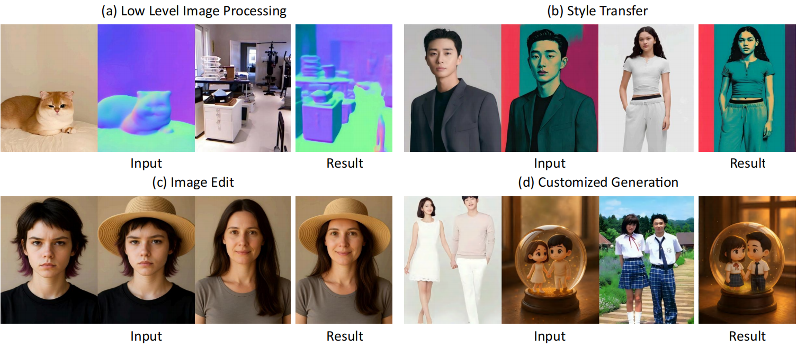
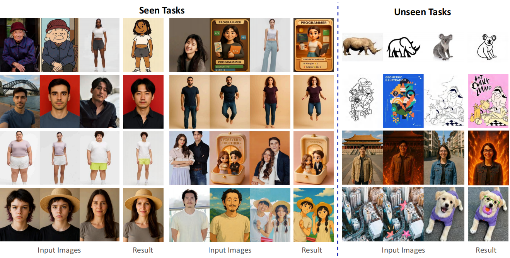

# RelationAdapter

> **RelationAdapter: Learning and Transferring Visual Relation with Diffusion Transformers**
> <br>
> Yan Gong, 
> Yiren Song, 
> Yicheng Li, 
> Chenglin Li, 
> and 
> Yin Zhang
> <br>
> Zhejiang University, National University of Singapore
> <br>

<a href="https://arxiv.org/abs/"></a>
<a href="https://huggingface.co/handsomeWilliam/RelationAdapter/tree/main"></a>
<a href="https://huggingface.co/datasets/handsomeWilliam/Relation252K"></a>

<br>



## Quick Start
### Configuration
#### 1. **Environment setup**
```bash
git clone git@github.com:gy8888/RelationAdapter.git
cd RelationAdapter

conda create -n RelationAdapter python=3.11.10
conda activate RelationAdapter
```
#### 2. **Requirements installation**
```bash
pip install torch==2.5.1 torchvision==0.20.1 torchaudio==2.5.1 --index-url https://download.pytorch.org/whl/cu124
pip install --upgrade -r requirements.txt
```


### 2. Inference
We provided the integration of FluxPipeline pipeline with our model and uploaded the model weights to huggingface, it's easy to use the our model as example below:

simply run the inference script:
```
python infer_single.py
```


### 3. Weights
You can download the trained checkpoints of RelationAdapter and LoRA for inference. Below are the details of available models.

You would need to load the `RelationAdapter` checkpoints model in order to fuse the `LoRA` checkpoints.

|                          **Model**                           |                       **Description**                       |
| :----------------------------------------------------------: | :---------------------------------------------------------: |
| [RelationAdapter](https://huggingface.co/handsomeWilliam/RelationAdapter/blob/main/ip_adapter-100000.bin) |       Additional parameters from the RelationAdapter module are trained on the `Relation252K` dataset       |
| [LoRA](https://huggingface.co/handsomeWilliam/RelationAdapter/blob/main/pytorch_lora_weights.safetensors) |   LoRA parameters are trained on the `Relation252K` dataset    |


### 4. Dataset
<span id="dataset_setting"></span>
#### 2.1 Paired Dataset Format 
The paired dataset is stored in a .jsonl file, where each entry contains image file paths and corresponding text descriptions. Each entry includes source caption, target caption, and edit instruction describing the transformation from source image to target image.

Example format:

```json
      {
            "left_image_description": "Description of the left image",
            "right_image_description": "Description of the right image",
            "edit_instruction": "Instructions for the desired modifications",
            "img_name": "path/to/image_pair.jpg"
      },
      {
            "left_image_description": "Description of the left image2",
            "right_image_description": "Description of the right image2",
            "edit_instruction": "Another instruction",
            "img_name": "path/to/image_pair2.jpg"
      }
```
We have uploaded our datasets to [Hugging Face](https://huggingface.co/datasets/handsomeWilliam/Relation252K).

#### 2.2 Run-Ready Dataset Generation
To prepare the dataset for relational learning tasks such as analogy-based instruction scenarios, use the provided script
```
python dataset-All-2000-turn-5test.py
```

This script takes the original paired image dataset and converts it into a structured format where each entry includes:
Example format:

```json
      {
            "cond1": "path/to/prompt_image.jpg",
            "cond2": "path/to/reference_image.jpg",
            "source": "path/to/source_image.jpg",
            "target": "path/to/target_image.jpg",
            "text": "Instruction for the intended modifications"
      },
      {
            "cond1": "path/to/prompt_image2.jpg",
            "cond2": "path/to/reference_image2.jpg",
            "source": "path/to/source_image2.jpg",
            "target": "path/to/target_image2.jpg",
            "text": "Instruction for the second modification"
      }
```

### 5. Results




## Citation
```
@unpublished{yan2025relation,
  author       = {YanGong and Yiren Song and Yicheng Li and Chenglin Li and Yin Zhang},
  title        = {RelationAdapter: Learning and Transferring Visual Relation with Diffusion Transformers},
  note         = {Unpublished manuscript},
  year         = {2025},
  institution  = {Zhejiang University, National University of Singapore}
}
```